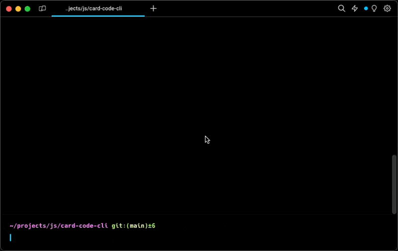
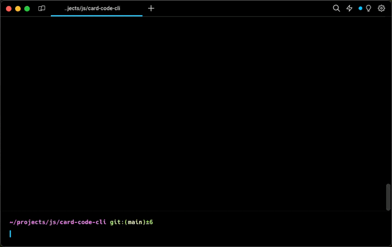

# CLI Programmable Card Code Emulator

Write and test programmable card code in a safe environment.

[](https://opensource.org/licenses/MIT)

## About

While exploring Programmable Banking Cards, I found it difficult to test my code. I wanted to be able to write code and test it in a safe environment. I also wanted to be able to share my code with others. This project is an attempt to solve these problems.

## Templates

Templates are the code that is run by the emulator. They are written in JavaScript and can be found in the `templates` directory. The template that is run by default is `empty`. This template does nothing and is a good starting point for writing your own templates.

Current Templates:

- `empty` - Does nothing
- `petrol_card` - A template for a petrol card
- `rooty` - A template for a sending a slack message after a transaction
- `telegram` - A template for sending a telegram message after a transaction
- `postman-echo` - A template for sending a transaction to [Postman Echo](https://learning.postman.com/docs/developer/echo-api/)

### Installation

If running from source, install the dependencies with:

```
npm i
```

### Usage



Options:

`-t, --template [template]` The template to run

`-a, --amount [amount]` The amount of the transaction

`-c, --currency [currency]` The currency of the transaction

`-e, --mcc [mcc]` The merchant category code of the transaction

`-m, --merchant [merchant]` The merchant name of the transaction

`-i, --city [city]` The city of the transaction

`-o, --country [country]` The country of the transaction

`-h, --help` Display help for command

`-v, --version` Display the current version

To run a transaction against a template, run the following command:

```
node . -t empty --amount 60000 --currency ZAR --mcc 0000 --merchant "Test Merchant" --city "Test City" --country ZA
```

If you want to run the emulator in a docker container, run the following commands:

```
docker build -t card-emu .
docker run card-emu -t petrol_card
```



## License

This project is licensed under the MIT License - see the [LICENSE.md](LICENSE.md) file for details
